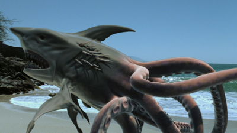
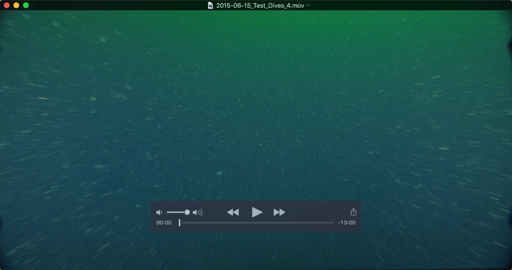

# Sharktopoda

Native video playback application for Mac OS X. Provides remote UDP interface for integration with other apps. See [REQUIREMENTS.md](docs/REQUIREMENTS.md) for the UDP remote interface specification.

A java implementation of a remote control is available in the [vcr4j-sharktopoda](https://github.com/hohonuuli/vcr4j/tree/master/vcr4j-sharktopoda) module of [vcr4j](https://github.com/hohonuuli/vcr4j)

## Screenshot

