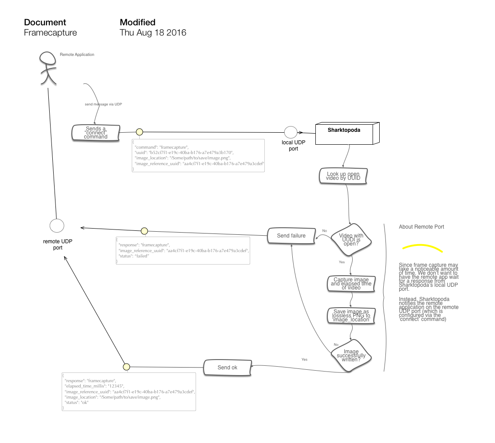

# Sharktopoda Requirements

Sharktopoda will be a Max OS X video playback application based on AVFoundation/AVKit. It supports a UDP connection allowing other local applications to connect to it. This connection allows other applications to control and query Sharktopoda.

Sharktopoda will display videos (either local files or remote URL's) in windows just like Apples' QuickTime app does. Each window will have an associated UUID (more about that below). Sharktopoda can route control/query commands to the appropriate video window with this UUID.

## UI

The UI can be the stock AVKit windows. It should have the controls pictured below. The window should be able to be resized. The ability to make a video window full-screen is not required.


## Configuring the UDP Port

- Under _Preferences_, a user should be able to specify the UDP port that can be used to connect to the app.
- This UDP port should be saved as a preference so it is preserved and restored if an application is shut down and restarted.

## Commands Accepted via the UDP port

Sharktopoda will receive JSON messages and respond with JSON via the UDP port configured under Preferences. It should support the following commands and corresponding functions:

### Connect

 Establishes a remote host and port number that Sharktopus can send additional out-of-band messages to (outside of the UDP command -> response messages). There are 2 forms of this message. 
 
 
 
 The first form omits the "host" field; Sharktopoda assumes that the host is "localhost".

```json
{
  "command": "connect",
  "port": "8095"
}
```

The second form explicitly specifies the host:

```json
{
  "command": "connect",
  "port": "8095",
  "host": "some.server.org"
}
```

### Open

Opens the specified video in a new window. The application should associate the URL and UUID with the window. (More on that later)

__Open URL__

```json
{
  "command": "open",
  "url": "http://someurl/and/moviefile.mov",
  "uuid": "b52cf7f1-e19c-40ba-b176-a7e479a3b170"
}
```

__Open File (using file URL)__

```json
{
  "command": "open",
  "url": "file://somefileurl/and/moviefile.mp4",
  "uuid": "b52cf7f1-e19c-40ba-b176-a7e479a3b170"
}
```

It should respond with:

__Successfully opened video response__

```json
{
  "response": "open",
  "status": "ok"
}
```

__Failed to open video response__

```json
{
  "response": "open",
  "status": "failed"
}
```


### Close

It should close the window with the corresponding UUID. No reponse is expected:

```json
{
  "command": "close",
  "uuid": "b52cf7f1-e19c-40ba-b176-a7e479a3b170"
}
```


### Show

Focuses the window containing the video with the given UUID and brings it to the front of all open Sharktopoda windows.

```json
{
  "command": "show",
  "uuid": "b52cf7f1-e19c-40ba-b176-a7e479a3b170"
}
```

### Request Video Information for a Specific Window

`{"command":"request video information"}`

It should return the UUID and URL of the currently focused (or top most in z order)

```json
{
  "response": "request video information",
  "uuid": "b52cf7f1-e19c-40ba-b176-a7e479a3b170",
  "url": "http://someurl/and/moviefile.mov"
}
```

### Request information for all open videos

`{"command": "request all information"}`

It should return info for all open videos like the following:

```json
{
  "response": "request all information",
  "videos": [
    {
      "uuid": "b52cf7f1-e19c-40ba-b176-a7e479a3b170",
      "url": "http://someurl/and/moviefile.mov"
    },
    {
      "uuid": "b52cf7f1-e19c-40ba-b176-a7e479a3b170",
      "url": "file://sometoherurl/and/moviefile.mp4"
    }
  ]
}
```

### Play

Play the video associated with the UUID. The play rate will be 1.0

```json
{
  "command": "play",
  "uuid": "b52cf7f1-e19c-40ba-b176-a7e479a3b170"
}
```

Optionally the play command can contain a rate for the playback. A positive rate is forward, negative is reverse.

```json
{
  "command": "play",
  "uuid": "b52cf7f1-e19c-40ba-b176-a7e479a3b170",
  "rate": "-2.4"
}
```
It should respond with:

```json
{
  "response":"play",
  "uuid": "b52cf7f1-e19c-40ba-b176-a7e479a3b170",
  "status":"ok"
}
```

or

```json
{
  "response":"play",
  "uuid": "b52cf7f1-e19c-40ba-b176-a7e479a3b170",
  "status": "failed"
}
```

### Pause

Pauses the playback for the video specified by the UUID

```json
{
  "command": "pause",
  "uuid": "b52cf7f1-e19c-40ba-b176-a7e479a3b170"
}
```

It should respond with:

```json
{
  "response":"play",
  "uuid": "b52cf7f1-e19c-40ba-b176-a7e479a3b170",
  "status":"ok"
}
```

or

```json
{
  "response":"play",
  "uuid": "b52cf7f1-e19c-40ba-b176-a7e479a3b170",
  "status": "failed"
}
```

### Request elapsed time

Return the elapsed time (from the start) of the video as milliseconds.

```json
{
  "command": "request elapsed time",
  "uuid": "b52cf7f1-e19c-40ba-b176-a7e479a3b170"
}
```

It should respond with:

```json
{
  "response": "request elapsed time",
  "uuid": "b52cf7f1-e19c-40ba-b176-a7e479a3b170",
  "elapsed_time_millis": "12345"
}
```

### Request Status

Return the current playback status of the video (by UUID). Possible responses include: _shuttling forward_, _shuttling reverse_, _paused_, _playing_, _not found_.

- _playing_ is when the video is playing at a rate of 1.0
- _shuttling forward_ is when the video is playing with a positive rate that is not equal to 1.0
- _shuttling reverse_ is when the video is playing with a negative rate.
- _paused_ is obvious. (Not playing)

`{"command": "request status", "uuid": "b52cf7f1-e19c-40ba-b176-a7e479a3b170"}`

A response is:

```json
{"response": "request status", "uuid": "b52cf7f1-e19c-40ba-b176-a7e479a3b170", "status": "playing"}
```

### Seek Elapsed Time

Seek to the provided elapsed time (which will be in milliseconds)

```json
{
  "command": "seek elapsed time",
  "uuid": "b52cf7f1-e19c-40ba-b176-a7e479a3b170",
  "elapsed_time_millis": "12345"
}
```

### Framecapture

Sharktopoda should immediately grab the current frame from the video along with the elapsed time of that frame. The image should be saved (in a separate non-blocking thread. I think this is the default in AVFoundation). This action should not interfere with video playback.

 

```json
{
  "command": "framecapture",
  "uuid": "b52cf7f1-e19c-40ba-b176-a7e479a3b170",
  "image_location": "/Some/path/to/save/image.png",
  "image_reference_uuid": "aa4cf7f1-e19c-40ba-b176-a7e479a3cdef"
}
```

When the image has been written to disk it should respond via the remote UDP port specified in the _connect_ command with:

```json
{
  "response": "framecapture",
  "elapsed_time_millis": "12345",
  "image_reference_uuid": "aa4cf7f1-e19c-40ba-b176-a7e479a3cdef",
  "image_location": "/Some/path/to/save/image.png",
  "status": "ok"
}
```

The _status_ field should be `"failed"` if Sharktopus is unable to capture and write the image to disk.

## Nice to Haves

These are optional features but are not required.

### Frame advance

Advance the video one frame for the given video The UDP/JSON command is

```json
{
  "command": "frame advance",
  "uuid": "cb5cf7f1-e19c-40ba-b176-a7e479a3cdef"
}
```
