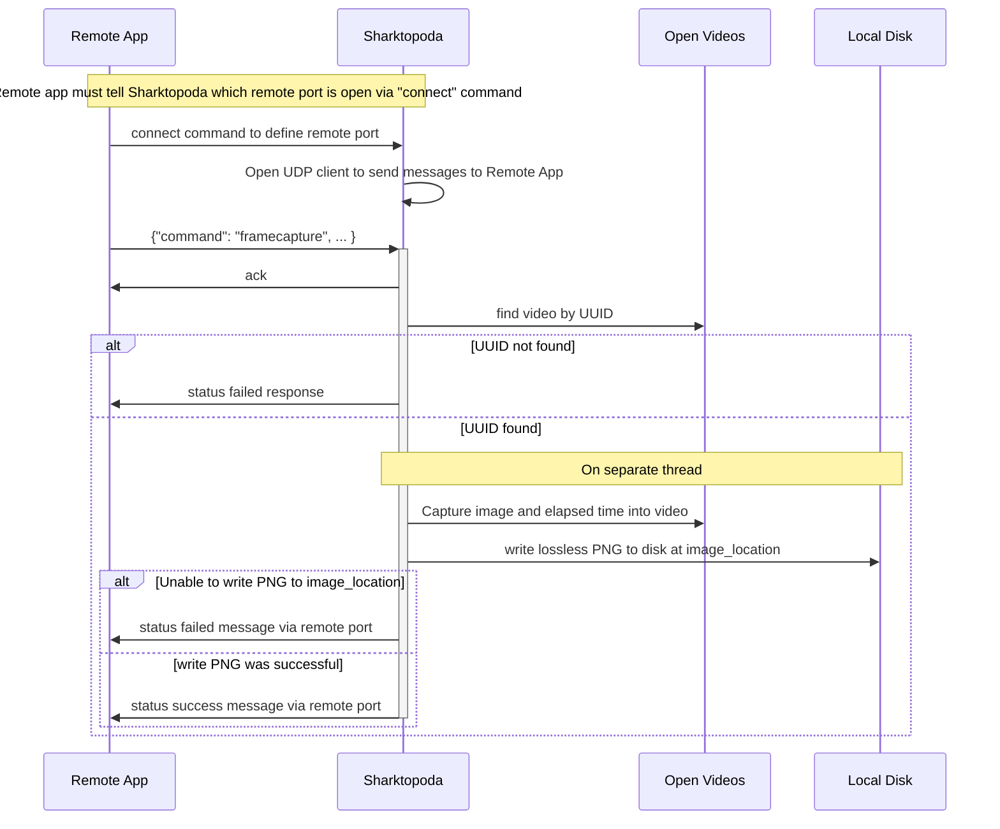

# Sharktopoda 2 Requirements

_Sharktopoda 2_ will be a video player that supports MBARI's video annotation and machine learning efforts. It is a native desktop application that will support remote control from other applications via UDP. In addition, it will display rectangular regions of interest (ROIs, aka _localizations_, aka _bounding boxes_) and allow the user to interact (e.g. create, edit, delete) with them. A brief example is illustrated at <https://youtu.be/FKeuG8-UYC0>/

## Overview

_Sharktopoda 2_ will be a Max OS X video playback application based on AVFoundation/AVKit. It supports a UDP connection allowing other local applications to connect to it. This connection allows:

1. Other applications to remotely control and query Sharktopoda.
2. Other applications to send localizations, which are named rectangular regions of interest, to Sharktopoda as well as commands that mutate (update, delete) localizations in Sharktopoda.
3. Sharktopoda to send commands that create, update, and delete localizations in the remote app.

Sharktopoda will display videos (either local files or remote URL's) in windows just like Apples' QuickTime app does. Each window will have a unique UUID associated to the window (more about that below). Sharktopoda can route control/query commands to the appropriate video window with this UUID.

Sharktopoda will support the creating, editing, deletion, and display of bounding boxes over top of the video. The video player will display prexisting bounding boxes over the video at the correct frame.

## UI

The UI can be based on the stock AVKit toolkit. Do not use floating controls in the video player as this will interfere with the ability to draw bounding bxoes on top of the video. If using AVKit, use inline controls (i.e. `AVPlayerViewControlsStyle.inline`) The window should be able to be resized. The ability to make a video window full-screen is nice-to-have, but not required.

## Configuring the UDP Port

- Under _Preferences_, a user should be able to specify the UDP port that can be used by a remote application to connect to, and control, Sharktopoda.
- This UDP port should be saved as a preference so it is preserved and restored if an application is shut down and restarted.

## Commands Accepted via the UDP port

Sharktopoda will receive JSON messages and respond with JSON via the UDP port configured under Preferences. __NOTE__: The messages below are pretty formatted for clarity, they do not need to be in the application. It's recommended that the messages are minified. The order of the JSON fields is not important. The maximum message size is 4096 bytes and should be encoded as UTF-8.

The application should support the following commands and corresponding functions:

### Connect

 Establishes a remote host and port number that Sharktopoda (the video player) can send outgoing UDP messages to another application. There are 2 forms of this message.

 

 The first form omits the "host" field; Sharktopoda assumes that the host is "localhost".

```json
{
  "command": "connect",
  "port": "8095"
}
```

The second form explicitly specifies the host:

```json
{
  "command": "connect",
  "port": "8095",
  "host": "some.server.org"
}
```

It should respond with an ok:

```json
{
  "response": "connect",
  "status": "ok"
}
```

TODO: how to handle failures?

### -- Open

Opens the specified video in a new window. The application should associate the URL and UUID with the window. (More on that later).

If a window with the UUID already exits, treat the open command as "show" command below, and a success response returned.

#### Open URL

```json
{
  "command": "open",
  "uuid": "b52cf7f1-e19c-40ba-b176-a7e479a3b170",
  "url": "http://someurl/and/moviefile.mov"
}
```

#### Open File (using file URL)

```json
{
  "command": "open",
  "uuid": "b52cf7f1-e19c-40ba-b176-a7e479a3b170",
  "url": "file:/somefileurl/and/moviefile.mp4"
}
```

Either open command should respond with a success or failure message:

##### Successfully opened video response

```json
{
  "response": "open",
  "status": "ok"
}
```

##### Failed to open video response

```json
{
  "response": "open",
  "status": "failed"
}
```

### -- Close

It should close the window with the corresponding UUID:

```json
{
  "command": "close",
  "uuid": "b52cf7f1-e19c-40ba-b176-a7e479a3b170"
}
```

Close should respond with an ack even if no window with a matching UUID is found

```json
{
  "response": "close",
  "status": "ok"
}
```

### -- Show

Focuses the window containing the video with the given UUID and brings it to the front of all open Sharktopoda windows. Some UI toolkits don't grab focus if the app is not already focused. In that case, simply bring the window to the front of the other open Sharktopoda windows.

```json
{
  "command": "show",
  "uuid": "b52cf7f1-e19c-40ba-b176-a7e479a3b170"
}
```

Show should respond with an ack:

```json
{
  "response": "show",
  "status": "ok"
}
```

IF the window with UUID does not exist it should respond with

```json
{
  "response": "show",
  "status": "failed"
}
```

### -- Request Video Information for the focused Window

// TODO should this use a UUID instead of the focused window or maybe that should be a separate command

```json
{"command": "request information"}
```

It should return the UUID and URL of the currently focused (or top most window in z order) as well as the length of the video in milliseconds (named as `duration_millis`) and the frame_rate of the mov

```json
{
  "response": "request information",
  "uuid": "b52cf7f1-e19c-40ba-b176-a7e479a3b170",
  "url": "http://someurl/and/moviefile.mov",
  "durationMillis": 150000,
  "frameRate": "29.97"
}
```

### -- Request information for all open videos

```json
{"command": "request all information"}
```

It should return info for all open videos like the following:

```json
{
  "response": "request all information",
  "videos": [
    {
      "uuid": "b52cf7f1-e19c-40ba-b176-a7e479a3b170",
      "url": "http://someurl/and/moviefile.mov"
      "durationMillis": 150000,
    },
    {
      "uuid": "b52cf7f1-e19c-40ba-b176-a7e479a3b170",
      "url": "file://sometoherurl/and/moviefile.mp4"
      "durationMillis": 250300,
    }
  ]
}
```

### -- Play

Play the video associated with the UUID. The play rate will be 1.0 which is normal playback speed.

```json
{
  "command": "play",
  "uuid": "b52cf7f1-e19c-40ba-b176-a7e479a3b170"
}
```

Optionally the play command can contain a rate for the playback. A positive rate is forward, negative is reverse.

```json
{
  "command": "play",
  "uuid": "b52cf7f1-e19c-40ba-b176-a7e479a3b170",
  "rate": "-2.4"
}
```

It should respond with:

```json
{
  "response": "play",
  "status":"ok"
}
```

or

```json
{
  "response": "play",
  "status": "failed"
}
```

### -- Pause

Pauses the playback for the video specified by the UUID

```json
{
  "command": "pause",
  "uuid": "b52cf7f1-e19c-40ba-b176-a7e479a3b170"
}
```

It should respond with:

```json
{
  "response": "pause",
  "status":"ok"
}
```

or, in the case of failure, such as the requested video UUID does not exist:

```json
{
  "response": "pause",
  "status": "failed"
}
```

### -- Request elapsed time

Return the elapsed time (from the start) of the video as milliseconds.

```json
{
  "command": "request elapsed time",
  "uuid": "b52cf7f1-e19c-40ba-b176-a7e479a3b170"
}
```

It should respond with:

```json
{
  "response": "request elapsed time",
  "elapsedTimeMillis": "12345",
  "status": "ok"
}
```

or the following in the UUID does not exist:

```json
{
  "response": "request elapsed time",
  "status": "failed"
}
```

### -- Request Status

Return the current playback status of the video (by UUID). Possible responses include: `shuttling forward`, `shuttling reverse`, `paused`, `playing`, `not found`.

- _playing_ is when the video is playing at a rate of 1.0
- _shuttling forward_ is when the video is playing with a positive rate that is not equal to 1.0
- _shuttling reverse_ is when the video is playing with a negative rate.
- _paused_ is obvious. (Not playing)

```json
{
  "command": "request status", 
  "uuid": "b52cf7f1-e19c-40ba-b176-a7e479a3b170"
}
```

An example response is:

```json
{
  "response": "request status", 
  "status": "playing"}
```

### -- Seek Elapsed Time

Seek to the provided elapsed time (which will be in milliseconds)

```json
{
  "command": "seek elapsed time",
  "uuid": "b52cf7f1-e19c-40ba-b176-a7e479a3b170",
  "elapsedTimeMillis": "12345"
}
```

Seek should respond with an ok:

```json
{
  "response": "seek elapsed time",
  "status": "ok"
}
```

or the following in the UUID does not exist or the elapsedTimeMillis is before/after the videos start/end:

```json
{
  "response": "seek elapsed time",
  "status": "failed"
}
```

### -- Frame advance

Advance the video one frame for the given video The UDP/JSON command is

```json
{
  "command": "frame advance",
  "uuid": "cb5cf7f1-e19c-40ba-b176-a7e479a3cdef"
}
```

Frame advance should respond with an ack:

```json
{
  "response": "frame advance",
  "status": "ok"
}
```

or the following in the UUID does not exist:

```json
{
  "response": "frame advance",
  "status": "failed"
}
```

### -- Framecapture

Sharktopoda should immediately grab the current frame from the video along with the elapsed time of that frame. The image should be saved (in a separate non-blocking thread. I think this is the default in AVFoundation). This action should not interfere with video playback.



 

```json
{
  "command": "frame capture",
  "uuid": "b52cf7f1-e19c-40ba-b176-a7e479a3b170",
  "imageLocation": "/Some/path/to/save/image.png",
  "imageReferenceUuid": "aa4cf7f1-e19c-40ba-b176-a7e479a3cdef"
}
```

When Sharktopoda receives the command is should response with an ack:

```json
{
  "response": "frame capture",
  "status" : "ok"
}
```

After the image has been written to disk, Sharktopoda should inform the remote app that the image has successfully been written to disk via the remote UDP port specified in the _connect_ command.

```json
{
  "command": "frame capture done",
  "elapsedTimeMillis": "12345",
  "imageReferenceUuid": "aa4cf7f1-e19c-40ba-b176-a7e479a3cdef",
  "imageLocation": "/Some/path/to/save/image.png",
  "status": "ok",
  "uuid": "b52cf7f1-e19c-40ba-b176-a7e479a3b170"
}
```

The _status_ field should be `"failed"` if Sharktopus is unable to capture and write the image to disk.

```json
{
  "command": "frame capture done",
  "imageReferenceUuid": "aa4cf7f1-e19c-40ba-b176-a7e479a3cdef",
  "imageLocation": "/Some/path/to/save/image.png",
  "status": "failed",
  "uuid": "b52cf7f1-e19c-40ba-b176-a7e479a3b170"
}
```

Finally, the remote app will respond with an ok:

```json
{
  "response": "frame capture done",
  "status": "ok"
}
```

## Localizations

A localization defines a rectangular region of interest on the video. Users should be able to draw these regions directly on a video window in sharktopoda. Sharktopoda will, in turn, notify the remote app that a new localization has been created. Sharktopoda needs to be able to handle 10,000s of localizations in a video and have them drawn on the correct frames as the video is played, rewinded, etc.

Localizations can be added, deleted, or modified from either a remote app or from sharktopoda. If a localization is created/mutated in Sharktopoda, it will notify the remote app using UDP via the port defined by the connect command.

Incoming messages will be no larger than 4096 bytes. In practice, the remote application will not send more than 10 localization to Sharktopoda in a single Add or Update message.

```mermaid

### -- Add Localization(s)

The initiating app (both sharktopoda and the remote app can create localizations) will send a notification of a new localizations to the other app.

```json
{
  "command": "add localizations",
  "uuid": "<the video's uuid>",
  "localizations": [
    {
      "uuid": "<uuid unique to this localization>",
      "concept": "Bathybembix bairdii",
      "elapsedTimeMillis": 49211,
      "x": 1076,
      "y": 13,
      "width": 623,
      "height": 475,
      "color": "#FFDDDD" // optional field. if unspecified, the default is #FFFFFF
    }
  ]
}
```

The receiving app should respond with an ack:

```json
{
  "response": "add localizations",
  "status": "ok"
}
```

or a failure if the video with uuid does not exist:

```json
{
  "response": "add localizations",
  "status": "failed"
}
```

### -- Localizaton(s) deleted

The initiating app will send a notification of localizations to be deleted.

```json
{
  "commmand": "remove localizations",
  "uuid": "<the video's uuid>",
  "localizations": [
    "<uuid for localiation A>",
    "<uuid for localiation B>"
  ]
}
```

The receiving app will respond with an ack:

```json
{
  "response": "remove localizations",
  "status": "ok"
}
```

or a failure if the video with uuid does not exist:

```json
{
  "response": "remove localizations",
  "status": "failed"
}
```

### -- Localizations(s) modified

Update existing localizations in Sharktopoda. If a matching localization's UUID does not exist, ignore that localization. (i.e. do not add, do not update)

```json
{
  "command": "update localizations",
  "uuid": "<the video's uuid>",
  "localizations": [
    {
      "uuid": "<uuid unique to this localization>",
      "concept": "Bathybembix bairdii",
      "elapsedTimeMillis": 49211,
      "durationMillis": 25, // optional
      "x": 1076,
      "y": 13,
      "width": 623,
      "height": 475
    }
  ]
}
```

The receiving app will respond with an ack:

```json
{
  "response": "update localizations",
  "status": "ok"
}
```

or a failure if the video with uuid does not exist:

```json
{
  "response": "update localizations",
  "status": "failed"
}
```

### -- Clear all Localizations

This will only be sent from the remote app to Sharktopoda (not vice versa). Sharktopoda should remove all cached information about the localizations for a given video.

```json
{
  "command": "clear localizations",
  "uuid": "<the video's uuid>"
}
```

Sharktopoda will respond with an ack:

```json
{
  "response": "clear localizations",
  "status": "ok"
}
```

or a failure if the video with uuid does not exist:

```json
{
  "response": "clear localizations",
  "status": "failed"
}
```
