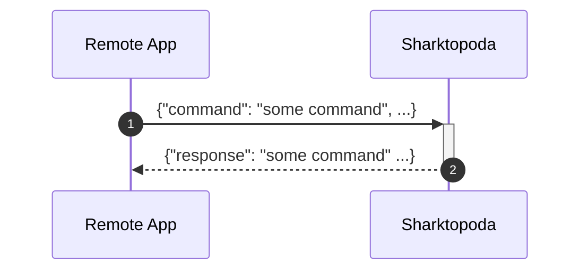
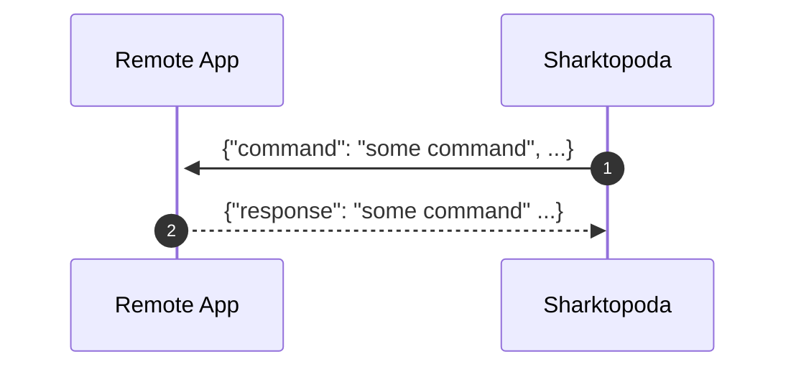
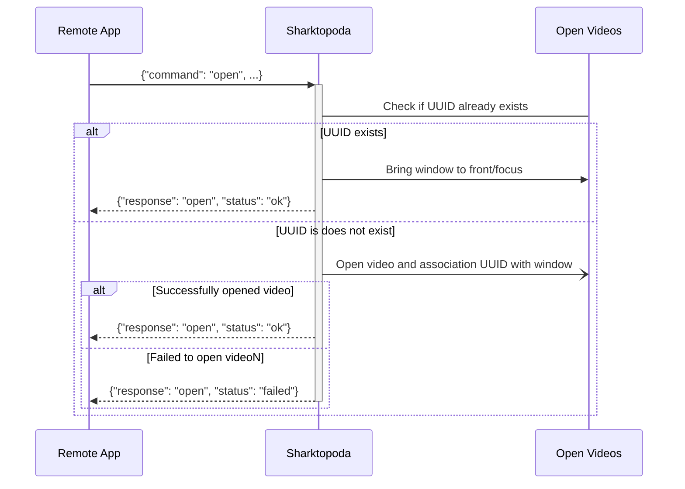
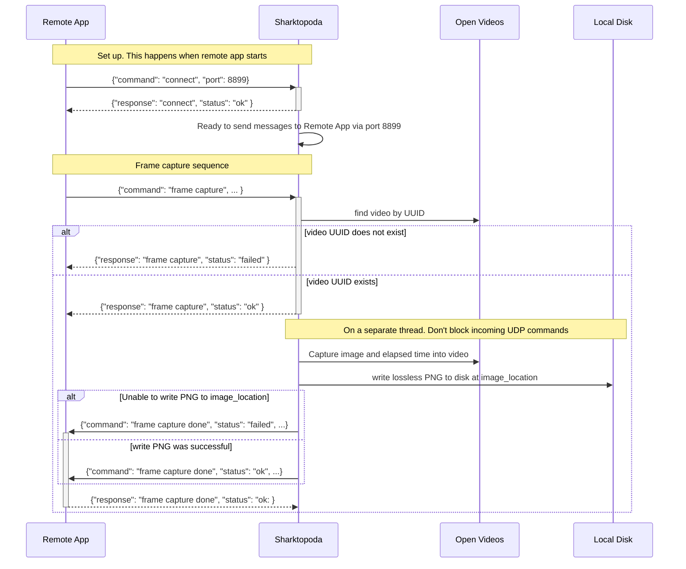
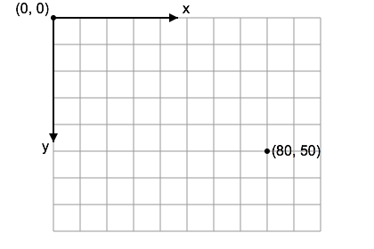

# UDP Remote Protocol

## Overview

### Incoming commands

##### Control Commands

`Sharktopoda 2` will support a remote protocol that will allow other applications to send commands to it via UDP. The protocol will support the following control commands:

- [Connect](#---connect)
- [Open](#---open)
- [Close](#---close)
- [Show](#---show)
- [Request information](#---request-video-information-for-the-focused-or-top-most-in-z--order-window)
- [Request all information](#---request-information-for-all-open-videos)
- [Play](#---play)
- [Pause](#---pause)
- [Request elapsed time](#---request-elapsed-time)
- [Request status](#---request-status)
- [Seek elapsed time](#---seek-elapsed-time)
- [Frame advance](#---frame-advance)
- [Frame capture](#---frame-capture)
- [Ping](#---ping)

##### Localization Commands

In addition to the control commands, the remote protocol will also support commands for managing information about localizations, aka rectangular regions of interest, displayed over video during playback.

- [Add localizations](#---add-localizations)
- [Remove localizations](#---localizatons-deleted)
- [Update localizations](#---localizationss-modified)
- [Clear localizations](#---clear-all-localizations)
- [Select localizations](#---select-localizations)

##### Command-Response Pattern



##### Command Message Failures

All commands are expected to be valid JSON messages as per the individual command descriptions herein. 

Invalid JSON command values will be reported as:

```json
{
  "command": "unknown",
  "status": "failed",
  "cause": "Invalid command"
}
```

Invalid JSON message structure will be reported as:

```json
{
  "command": <some command>,
  "status": "failed",
  "cause": "Invalid message"
}
```

NOTE: Sharktopoda does not determine or report why the message structure was invalid. It is expected the developer of the control messaging app will consult these requirements to determine the actual cause.


### Outgoing commands

Sharktopoda can also send certain commands to the Remote App. These commands are explicitly sent to the **host/port** established by a preceding [connect](#---connect) control command. The amount of time to wait for a response (i.e. timeout) will be set in the preferences UI. These commands are:

- [Frame capture done](#---frame-capture)
- [Add localizations](#---add-localizations)
- [Remove localizations](#---localizatons-deleted)
- [Update localizations](#---localizationss-modified)
- [Clear localizations](#---clear-all-localizations)
- [Select localizations](#---select-localizations)
- [Ping](#---ping)



## Commands Accepted via the UDP port

Sharktopoda will receive JSON messages and respond with JSON via the UDP port configured under Preferences. __NOTE__: The messages below are pretty formatted for clarity, they do not need to be in the application. It's recommended that the messages are minified. The order of the JSON fields is not important. The maximum message size is 4096 bytes and should be encoded as UTF-8.

The application should support the following commands and corresponding functions:

### -- Connect

 Establishes a remote host and port number that Sharktopoda (the video player) can send outgoing UDP messages to another application. When a `connect` command is received, Sharktopoda should send a [ping](#---ping) command to verify that the port is reachable.

 ```mermaid
sequenceDiagram 
    participant R as Remote App
    participant S as Sharktopoda

    Note over R,S: connect sent to Sharktopoda's UDP port
    R->>+S: {"command": "connect", "port": <port number>}
    S-->>-R: {"response": "connect", "status": "ok"}

    Note over R,S: ping sent to <port number> to verify it is open.
    S->>+R: {"command": "ping"}
    alt Ping timed out
      S->>S: Display error dialog
    else Ping succeeded
      R-->>-S: {"response": "ping"}
      S->>S: Set port/host in memory for later use
      Note over R,S: Use port/host for outgoing commands, e.g.:
      S->>+R: {"command": "add localizations", ...}
      R-->>-S: {"response": "add localizations", ...}
    end
 ```

 There are 2 forms of this message. The first form omits the "host" field; Sharktopoda assumes that the host is "localhost".

```json
{
  "command": "connect",
  "port": 8095
}
```

The second form explicitly specifies the host:

```json
{
  "command": "connect",
  "port": 8095,
  "host": "some.server.org"
}
```

It should respond with an ok:

```json
{
  "response": "connect",
  "status": "ok"
}
```

Note, the response is always "ok".

### -- Open

Opens the specified video in a new window. The application should associate the URL and UUID with the window. (More on that later). If a new window is opened, the video should be immediately paused. (We don't want the video to autoplay when it is first opened)

If a window with the UUID already exits, treat the open command as "show" command below, and a success response returned.



#### Open URL

```json
{
  "command": "open",
  "uuid": "b52cf7f1-e19c-40ba-b176-a7e479a3b170",
  "url": "http://someurl/at/moviefile.mov"
}
```

#### Open File (using file URL)

```json
{
  "command": "open",
  "uuid": "b52cf7f1-e19c-40ba-b176-a7e479a3b170",
  "url": "file:/somefile/at/moviefile.mp4"
}
```

Either open command should respond with a success or failure message:

##### Successfully opened video response

```json
{
  "response": "open",
  "status": "ok"
}
```

##### Failed to open video response

```json
{
  "response": "open",
  "status": "failed"
}
```

### -- Close

It should close the window with the corresponding UUID:

```json
{
  "command": "close",
  "uuid": "b52cf7f1-e19c-40ba-b176-a7e479a3b170"
}
```

Close should respond with an ack even if no window with a matching UUID is found

```json
{
  "response": "close",
  "status": "ok"
}
```

### -- Show

Focuses the window containing the video with the given UUID and brings it to the front of all open Sharktopoda windows. Some UI toolkits do not grab focus if the app is not already focused. In that case, simply bring the window to the front of the other open Sharktopoda windows.

```json
{
  "command": "show",
  "uuid": "b52cf7f1-e19c-40ba-b176-a7e479a3b170"
}
```

Show should respond with an ack:

```json
{
  "response": "show",
  "status": "ok"
}
```

If the window with UUID does not exist it should respond with

```json
{
  "response": "show",
  "status": "failed"
}
```

### -- Request Video Information for the focused or top most (in Z- order) Window

```json
{"command": "request information"}
```

It should return the UUID and URL of the current or last focused window as well as the length of the video in milliseconds (named as `durationMillis`) and the frame_rate of the mov. The `isKey` field indicates if the window is currently handling user keyboard input.

```json
{
  "response": "request information",
  "status": "ok",
  "uuid": "b52cf7f1-e19c-40ba-b176-a7e479a3b170",
  "url": "http://someurl/and/moviefile.mov",
  "durationMillis": 150000,
  "frameRate": 29.97,
  "isKey": true
}
```

If no video windows are currently available (i.e., either no successful **open** commands or all previously opened videos have been closed), it should respond with

```json
{
  "response": "request information",
  "status": "ok",
  "cause": "No open videos"
}
```

### -- Request information for all open videos

```json
{"command": "request all information"}
```

It should return info for all open videos like the following:

```json
{
  "response": "request all information",
  "status": "ok",
  "videos": [
    {
      "uuid": "b52cf7f1-e19c-40ba-b176-a7e479a3b170",
      "url": "http://someurl/and/moviefile.mov"
      "durationMillis": 150000,
      "frameRate": 29.97,
      "isKey": false
    },
    {
      "uuid": "b52cf7f1-e19c-40ba-b176-a7e479a3b170",
      "url": "file://sometoherurl/and/moviefile.mp4"
      "durationMillis": 250300,
      "frameRate": 59.97,
      "isKey": true
    }
  ]
}
```

If no currently available video windows, it should respond the same as **request information**.

### -- Play

Play the video associated with the UUID. The play rate will be 1.0 which is normal playback speed.

```json
{
  "command": "play",
  "uuid": "b52cf7f1-e19c-40ba-b176-a7e479a3b170"
}
```

Optionally the play command can contain a rate for the playback. A positive rate is forward, negative is reverse. 1.0 is normal speed, 2.0
is twice normal speed. -0.5 is half speed in reverse.

```json
{
  "command": "play",
  "uuid": "b52cf7f1-e19c-40ba-b176-a7e479a3b170",
  "rate": -2.4
}
```

It should respond with:

```json
{
  "response": "play",
  "status":"ok"
}
```

or

```json
{
  "response": "play",
  "status": "failed"
}
```

### -- Pause

Pauses the playback for the video specified by the UUID

```json
{
  "command": "pause",
  "uuid": "b52cf7f1-e19c-40ba-b176-a7e479a3b170"
}
```

It should respond with:

```json
{
  "response": "pause",
  "status":"ok"
}
```

or, in the case of failure, such as the requested video UUID does not exist:

```json
{
  "response": "pause",
  "status": "failed"
}
```

### -- Request elapsed time

Return currently viewed moment of the video, i.e. the elapsed time (from the start) of the video as milliseconds.

```json
{
  "command": "request elapsed time",
  "uuid": "b52cf7f1-e19c-40ba-b176-a7e479a3b170"
}
```

It should respond with:

```json
{
  "response": "request elapsed time",
  "elapsedTimeMillis": 12345,
  "status": "ok"
}
```

or the following in the UUID does not exist:

```json
{
  "response": "request elapsed time",
  "status": "failed"
}
```

### -- Request Status

Return the current playback status of the video (by UUID) and the actual rate that the video is playing. Possible responses include: `shuttling forward`, `shuttling reverse`, `paused`, `playing`, `not found`.

- _playing_ is when the video is playing at a rate of 1.0
- _shuttling forward_ is when the video is playing with a positive rate that is not equal to 1.0
- _shuttling reverse_ is when the video is playing with a negative rate.
- _paused_ is obvious. (Not playing)

```json
{
  "command": "request status", 
  "uuid": "b52cf7f1-e19c-40ba-b176-a7e479a3b170"
}
```

An example response is:

```json
{
  "response": "request status", 
  "status": "playing",
  "rate": 1.0
}
```

or a failed response if the UUID does not exist:

```json
{
  "response": "request status", 
  "status": "failed"
}
```

### -- Seek Elapsed Time

Seek to the provided elapsed time (which will be in milliseconds)

```json
{
  "command": "seek elapsed time",
  "uuid": "b52cf7f1-e19c-40ba-b176-a7e479a3b170",
  "elapsedTimeMillis": 12345
}
```

Seek should respond with an ok:

```json
{
  "response": "seek elapsed time",
  "status": "ok"
}
```

or the following in the UUID does not exist or the elapsedTimeMillis is before/after the videos start/end:

```json
{
  "response": "seek elapsed time",
  "status": "failed"
}
```

### -- Frame advance

Advance or regress one frame for the given video. If the `direction` field is positive (i.e. 1) the the video should be advance one frame. If the `direction` is negative (-1), then the video should go back one frame. This is supported using [AVPlayerItem.step](https://developer.apple.com/documentation/avfoundation/avplayeritem/1387968-step) The UDP/JSON command is

```json
{
  "command": "frame advance",
  "uuid": "cb5cf7f1-e19c-40ba-b176-a7e479a3cdef",
  "direction": 1
}
```

Frame advance should respond with an ack:

```json
{
  "response": "frame advance",
  "status": "ok"
}
```

or the following in the UUID does not exist:

```json
{
  "response": "frame advance",
  "status": "failed"
}
```

### -- Frame capture

Sharktopoda should immediately grab the current frame from the video along with the elapsed time of that frame. The image should be saved (in a separate non-blocking thread. I think this is the default in AVFoundation). This action should not interfere with video playback or block incoming UDP commands.



The frame capture command specifies the path to save the image too as well as provides a UUID for the image. If an image already exists at that location, do not overwrite the image and respond with a "failed" status message.

```json
{
  "command": "frame capture",
  "uuid": "b52cf7f1-e19c-40ba-b176-a7e479a3b170",
  "imageLocation": "/Some/path/to/save/image.png",
  "imageReferenceUuid": "aa4cf7f1-e19c-40ba-b176-a7e479a3cdef"
}
```

When Sharktopoda receives the command is should response with an ok if the video UUID exists:

```json
{
  "response": "frame capture",
  "status" : "ok"
}
```

If the video UUID does not exist or an image already exists at `imageLocation` respond with:

```json
{
  "response": "frame capture",
  "status" : "failed"
}
```

After the image has been written to disk, Sharktopoda should inform the remote app that the image has successfully been written to disk via the remote UDP port specified in the _connect_ command.

```json
{
  "command": "frame capture done",
  "elapsedTimeMillis": 12345,
  "imageReferenceUuid": "aa4cf7f1-e19c-40ba-b176-a7e479a3cdef",
  "imageLocation": "/Some/path/to/save/image.png",
  "status": "ok",
  "uuid": "b52cf7f1-e19c-40ba-b176-a7e479a3b170"
}
```

The _status_ field should be `"failed"` if Sharktopus is unable to capture and write the image to disk.

```json
{
  "command": "frame capture done",
  "imageReferenceUuid": "aa4cf7f1-e19c-40ba-b176-a7e479a3cdef",
  "imageLocation": "/Some/path/to/save/image.png",
  "status": "failed",
  "uuid": "b52cf7f1-e19c-40ba-b176-a7e479a3b170"
}
```

Finally, the remote app will respond with an ok:

```json
{
  "response": "frame capture done",
  "status": "ok"
}
```

### --- Ping

This command simple checks that the port can be reached and the application responds. It should timeout if no response is received within the timeout specified in the Preferences dialog. Ping is both and incoming and outgoing command (i.e. Sharktopoda should be able to send and receive ping commands)

```json
{
  "command": "ping"
}
```

```json
{
  "response": "ping",
  "status": "ok"
}
```

## Localizations

A localization defines a rectangular region of interest on the video. Users should be able to draw these regions directly on a video window in sharktopoda. Sharktopoda will, in turn, notify the remote app that a new localization has been created. Sharktopoda needs to be able to handle 10,000s of localizations in a video and have them drawn on the correct frames as the video is playing, shuttling, etc. A Localization is also called an `Annotation` and has the following properties:

- `uuid` - The unique identifier for an annotation. UUID v4 (random) is recommended.
- `concept` - The label associated with a localization that identifies the object in the region of interest. In theory, the concept can be up to 256 characters long, but in practice it is much shorter.
- `elapsedTimeMillis` - The elapsed time from the start of the video that the localization is to be displayed.
- `durationMillis` - This field may be present but can be ignored for now. It represents how long the localization is valid. It will span from `elapsedTimeMillis` to `elapsedTimeMillis` + `durationMillis`. The default is 0 which means the localization is valid for a single frame.
- `x` - The x coordinate of the localization in pixels.
- `y` - The y coordinate of the localization in pixels.
- `width` - The width of the localization in pixels.
- `height` - The height of the localization in pixels.
- `color` - The color used to draw the localization.

`x`, `y`, `width`, and `height` are in the same coordinates as the unscaled video. Localizations use this image coordinate system where origin is the upper-left, +X is right, +Y is down:



Localizations can be added, selected, deleted, or modified from either a remote app __or__ from sharktopoda. If a localization is created/mutated in Sharktopoda, it will notify the remote app using UDP via the port defined by the connect command.

Incoming messages will be no larger than 4096 bytes. In practice, the remote application will not send more than 10 localizations to Sharktopoda in a single Add or Update message.

### -- Add Localization(s)

The initiating app (both sharktopoda and the remote app can create localizations) will send a notification of a new localizations to the other app.

```json
{
  "command": "add localizations",
  "uuid": "<the video's uuid>",
  "localizations": [
    {
      "uuid": "<uuid unique to this localization>",
      "concept": "Bathybembix bairdii",
      "elapsedTimeMillis": 49211,
      "durationMillis": 25, // optional, default is 0;
      "x": 1076,
      "y": 13,
      "width": 623,
      "height": 475,
      "color": "#FFDDDD" // optional field. if unspecified, the default is from the Annotation preferences pane
    }
  ]
}
```

The receiving app should respond with an ack:

```json
{
  "response": "add localizations",
  "status": "ok"
}
```

or a failure if the video with uuid does not exist:

```json
{
  "response": "add localizations",
  "status": "failed"
}
```

### -- Localizaton(s) deleted

The initiating app will send a notification of localizations to be deleted.

```json
{
  "commmand": "remove localizations",
  "uuid": "<the video's uuid>",
  "localizations": [
    "<uuid for localization A>",
    "<uuid for localization B>"
  ]
}
```

The receiving app will respond with an ok:

```json
{
  "response": "remove localizations",
  "status": "ok"
}
```

or a failure if the video with uuid does not exist:

```json
{
  "response": "remove localizations",
  "status": "failed"
}
```

### -- Localizations(s) modified

Update existing localizations in Sharktopoda. If a matching localization's UUID does not already exist in Sharktopoda, ignore that localization. (i.e. do not add, do not update)

```json
{
  "command": "update localizations",
  "uuid": "<the video's uuid>",
  "localizations": [
    {
      "uuid": "<uuid unique to this localization>",
      "concept": "Bathybembix bairdii",
      "elapsedTimeMillis": 49211,
      "durationMillis": 25, // optional, default is 0;
      "x": 1076,
      "y": 13,
      "width": 623,
      "height": 475,
      "color": "#FFDDDD" // optional field. if unspecified, the default is from the Annotation preferences pane
    }
  ]
}
```

The receiving app will respond with an ack:

```json
{
  "response": "update localizations",
  "status": "ok"
}
```

or a failure if the video with uuid does not exist:

```json
{
  "response": "update localizations",
  "status": "failed"
}
```

### -- Clear all Localizations

This will only be sent from the remote app to Sharktopoda (not vice versa). Sharktopoda should remove all cached information about the localizations for a given video.

```json
{
  "command": "clear localizations",
  "uuid": "<the video's uuid>"
}
```

Sharktopoda will respond with an ok:

```json
{
  "response": "clear localizations",
  "status": "ok"
}
```

or a failure if the video with uuid does not exist:

```json
{
  "response": "clear localizations",
  "status": "failed"
}
```

### -- Select Localizations

This indicates which localizations are _selected_. Selected localizations should be drawn in the selected color specified in the UI preferences.  If only a single localization is selected, that localization should become editable and be able to be moved and resized. When a select command is received, all previously selected annotations should no longer be selected and should be drawn using their original or default color. Any localization UUIDs that do not exist in Sharktopoda should be ignored.

```json
{
  "command": "select localizations"
  "uuid": "<the video's uuid>",
  "localizations": [
    "<uuid for localization A>",
    "<uuid for localization B>"
  ]
}
```

```json
{
  "response": "select localizations",
  "status": "ok"
}
```

or a failure if the video with uuid does not exist:

```json
{
  "response": "select localizations",
  "status": "failed"
}
```
