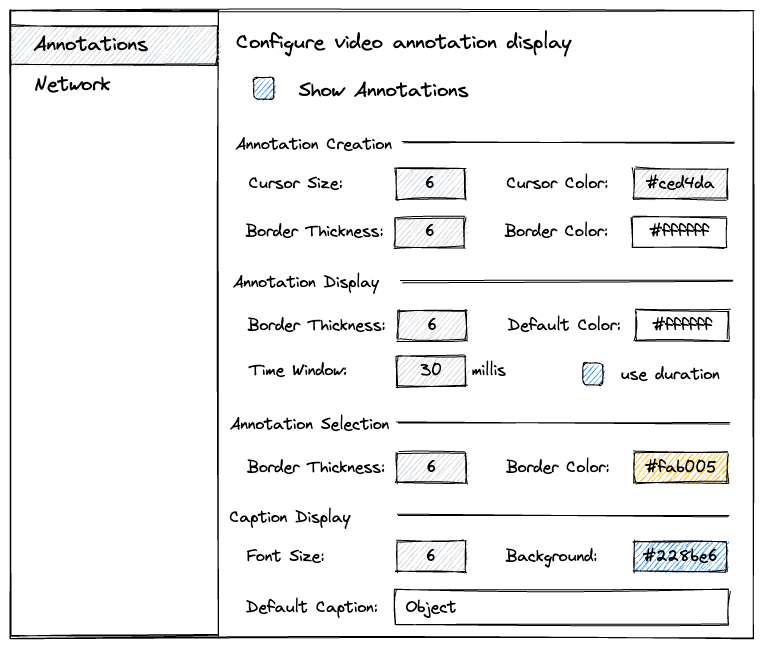

# UI

## Overview  

## Start up

When started, Sharktopoda should show a default window like:

This window should be closed when any video window is open. When all video windows are closed this window should be displayed. This is the same behavior as the [IINA video player](https://iina.io/).

Both `Open ...` and `Open URL ...` are buttons. When clicked, or the corresponding key strokes occur they should trigger their open action.

`Open ...` brings up a standard file browser.

`Open URL ...` should bring up a dialog that allows a user to enter a movie URL. This is the same behavior as `Open Location` in Apple's QuickTime player.

The `port` number at the bottom is the port that Sharktopoda is listening too for incoming UPD commands. It can be changed in _Preferences_.

## Preferences

Sharktopoda will have a standard _Preferences_ menu item:

When preferences is opened it will display a window with the tabs/sections shown below. Changes to preferences should be saved when editable field loses focus or the window is closed.

### Annotations

This section specifies how localizations (i.e. annotations) are drawn and represented over video. Most should be obvious but here are additional details on the non-obvious ones:

- __Show annotations check box__: When checked localizations are displayed over top of the video. When unchecked, no localizations are displayed/drawn.
- __Annotation Display > Time Window__: This defines how long a localization should be displayed. The time to display the localization is from `annotation.elapsedTimeMillis - timeWindow / 2.0` to `annotation.elapsedTimeMillis + timeWindow / 2.0`. (e.g. if `elapsedTimeMillis = 1000` and `timeWindow = 30`, the localization for the annotation should be drawn when the video is showing frames between 985 and 1015 milliseconds from the start of the video.

#### Annotation Creation

When a new annotation is created this section determines properties of the bounding box as it is being drawn.

#### Annotation Display

This section specifies the properties for an annotation _after_ it has been drawn on the video. By default an annotation is drawn using a the _Default color_ but each annotation may have it's own unique color assigned. Alternatively, all annotations can have a color assigned, when an annotation is created it get's assigned the default color.

#### Annotation Selection

This specifies the display of _selected_ annotations. Annotations can be selected, either by receiving a command via UPD or by clicking on the localization's border on top of the video.

### Network

The _Control Port_ sets the port to listen for incoming [UDP commands](UDP_Remote_Protocol.md). When the port is changed the old port should be closed and Sharktopoda should start listening on the new port.

The _Timeout_ sets the timeout in milliseconds for [outgoing commands](UDP_Remote_Protocol.md#outgoing-commands). This especially important for the [ping](UDP_Remote_Protocol.md#ping) command that is used to check if the Remote App is responsive.

## Behavior

The video window can be a standard AVKit window. Floating playback controls should not be used as they would interact with the interactive localization features. If using AVKit, use [inline](https://developer.apple.com/documentation/avkit/avplayerviewcontrolsstyle/inline) controls.

When a user clicks on the video (not the video controls) it begins a localization action. All localization actions initiate by the video player should immediately pause video playback. Localization actions [initiated by the remote app](UDP_Remote_Protocol.md#incoming-commands) should NOT pause video playback.

### Editing a localization

If the user clicks on the border of an existing localization, that single localization should be [selected](UDP_Remote_Protocol.md#select-localizations) and become editable, allowing a user to resize or move the localization. The following events set the new coordianates of the localization and send an [update](UDP_Remote_Protocol.md#localizationss-modified) of the localization to the remote app:

- The user hits enter or other definable key if enter can't be used. If we can't use enter, allows the key to be set in preferences.
- The video leaves the paused state.
- The user clicks on another localization.
- The user single clicks on the video anywhere other than the border/control points of the editable localization.

### Creating a localization

If the user single-clicks and drags on the video surface, begin drawing a rectangle. When the drag is released, [create a new localization using the caption defined in preferences and send it to the remote app](UDP_Remote_Protocol.md#add-localizations). 

The caption of a localization does not need to be editable in the video player. Typically, it will be changed by a remote app.
