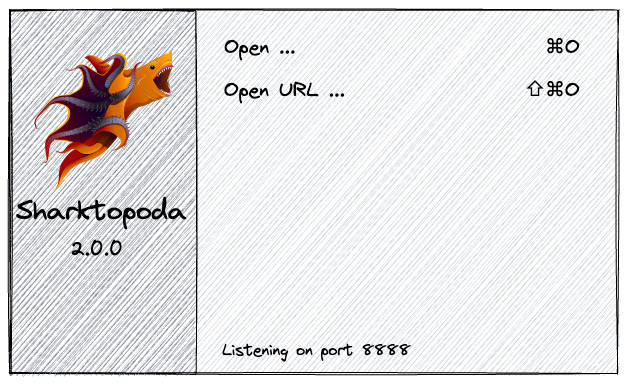

# UI

## Overview  

## Start up

When started, Sharktopoda should show a default window like:

This window should be closed when any video window is open. When all video windows are closed this window should be displayed. This is the same behavior as the [IINA video player](https://iina.io/).

Both `Open ...` and `Open URL ...` are buttons. When clicked, or the corresponding key strokes occur they should trigger their open action.

`Open ...` brings up a standard file browser.

`Open URL ...` should bring up a dialog that allows a user to enter a movie URL. This is the same behavior as `Open Location` in Apple's QuickTime player.

## Preferences

Sharktopoda will have a standard _Preferences_ menu item:

When preferences is opened it will display a window with the following tabs/sections:

### Annotations

This section specifies how localizations (i.e. annotations) are drawn and represented over video. 

#### Annotation Creation

When a new annotation is created this section determines properties of the bounding box as it is being drawn.

#### Annotation Display

This section specifies the properties for an annotation _after_ it has been drawn on the video. By default an annotation is drawn using a the _Default color_ but each annotation may have it's own unique color assigned. Alternatively, all annotations can have a color assigned, when an annotation is created it get's assigned the default color.

